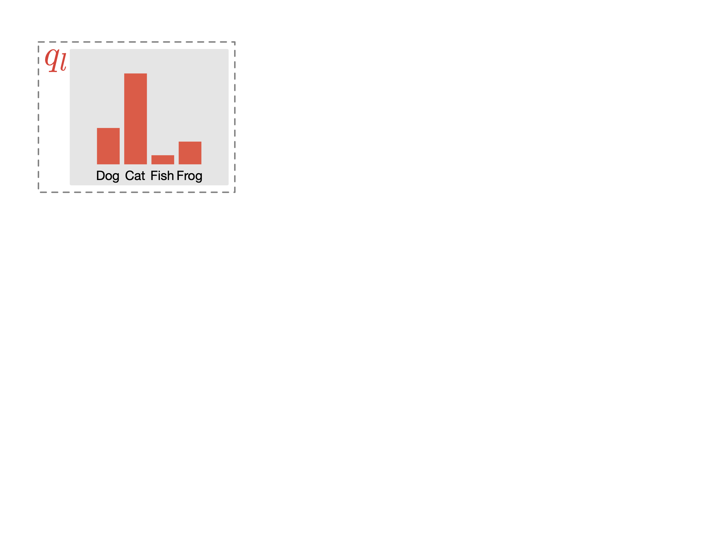

# SimPLE

The code for the
paper: "[SimPLE: Similar Pseudo Label Exploitation for Semi-Supervised Classification](https://arxiv.org/abs/2103.16725)"
by [Zijian Hu*](https://www.zijianhu.com/),
[Zhengyu Yang*](https://zhengyuyang.com/),
[Xuefeng Hu](https://xuefenghu.me/), and [Ram Nevatia](https://sites.usc.edu/iris-cvlab/professor-ram-nevatia/).

## Abstract



A common classification task situation is where one has a large amount of data available for training, but only a small
portion is annotated with class labels. The goal of semi-supervised training, in this context, is to improve
classification accuracy by leverage information not only from labeled data but also from a large amount of unlabeled
data. Recent works have developed significant improvements by exploring the consistency constrain between differently
augmented labeled and unlabeled data. Following this path, we propose a novel unsupervised objective that focuses on the
less studied relationship between the high confidence unlabeled data that are similar to each other. The new proposed
Pair Loss minimizes the statistical distance between high confidence pseudo labels with similarity above a certain
threshold. Combining the Pair Loss with the techniques developed by the MixMatch family, our proposed SimPLE algorithm
shows significant performance gains over previous algorithms on CIFAR-100 and Mini-ImageNet, and is on par with the
state-of-the-art methods on CIFAR-10 and SVHN. Furthermore, SimPLE also outperforms the state-of-the-art methods in the
transfer learning setting, where models are initialized by the weights pre-trained on ImageNet or DomainNet-Real.

## News

[11/8/2021]: bugfix that could result in incorrect data loading in distributed training <br>
[9/20/2021]: add data_dims option for data resizing <br>
[8/31/2021]: update the code base for easier extension <br>
[6/22/2021]: add Mini-ImageNet example <br>
[6/2/2021]: add animations and fix broken link in README <br>
[5/30/2021]: initial release

## Requirements

*see [requirements.txt](requirements.txt) for detail*

- Python 3.6 or newer
- [PyTorch](https://pytorch.org/) 1.6.0 or newer
- [torchvision](https://pytorch.org/docs/stable/torchvision/index.html) 0.7.0 or newer
- [kornia](https://kornia.readthedocs.io/en/latest/augmentation.html) 0.5.0 or newer
- numpy
- scikit-learn
- [plotly](https://plotly.com/python/) 4.0.0 or newer
- wandb 0.9.0 or newer (**optional**, required for logging to [Weights & Biases](https://www.wandb.com/)
  see [utils.loggers.WandbLogger](utils/loggers.py) for detail)

### Recommended versions

|Python|PyTorch|torchvision|kornia|
| --- | --- | --- | --- |
|3.8.5|1.6.0|0.7.0|0.5.0|

## Setup

### Install dependencies

using pip:

```shell
pip install -r requirements.txt
```

or using conda:

```shell
conda env create -f environment.yaml
```

## Running

### Example

To replicate Mini-ImageNet results

```shell
CUDA_DEVICE_ORDER="PCI_BUS_ID" CUDA_VISIBLE_DEVICES="0" \
python main.py \
@runs/miniimagenet_args.txt
```

To replicate CIFAR-10 results

```shell
CUDA_DEVICE_ORDER="PCI_BUS_ID" CUDA_VISIBLE_DEVICES="0" \
python main.py \
@runs/cifar10_args.txt
```

To replicate CIFAR-100 result (with distributed training)

```shell
CUDA_DEVICE_ORDER="PCI_BUS_ID" CUDA_VISIBLE_DEVICES="0,1" \
python -m torch.distributed.launch \
--nproc_per_node=2 main_ddp.py \
@runs/cifar100_args.txt \
--num-epochs 2048 \
--num-step-per-epoch 512
```

## Citation

```bibtex
@InProceedings{Hu-2020-SimPLE,
  author = {{Hu*}, Zijian and {Yang*}, Zhengyu and Hu, Xuefeng and Nevaita, Ram},
  title = {{SimPLE}: {S}imilar {P}seudo {L}abel {E}xploitation for {S}emi-{S}upervised {C}lassification},
  booktitle = {Proceedings of the IEEE/CVF Conference on Computer Vision and Pattern Recognition (CVPR)},
  month = {June},
  year = {2021},
  url = {https://arxiv.org/abs/2103.16725},
}
```
